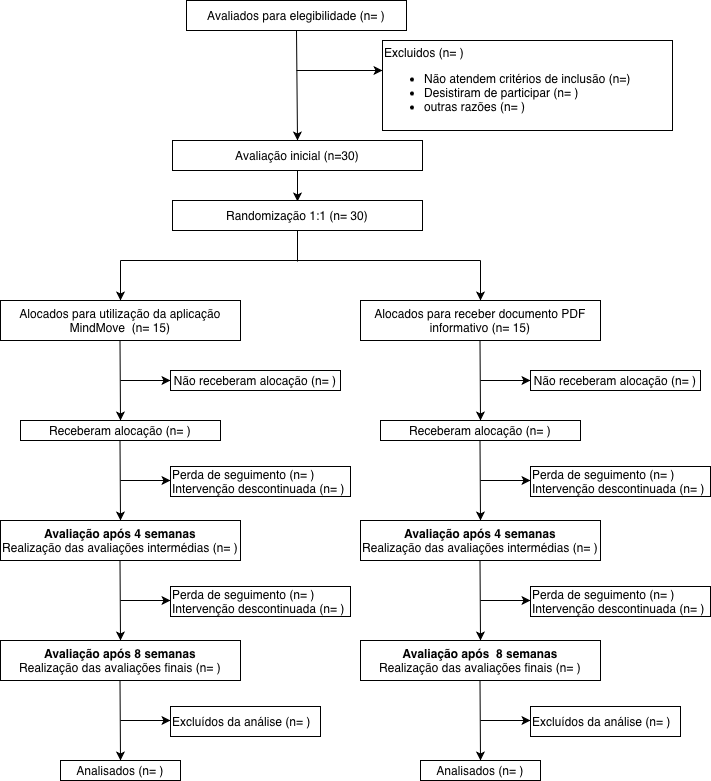
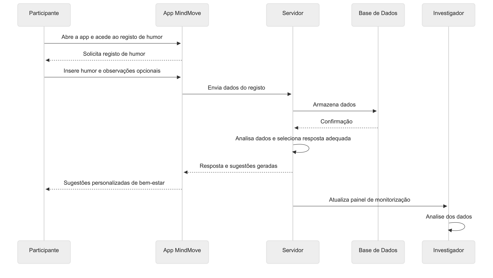
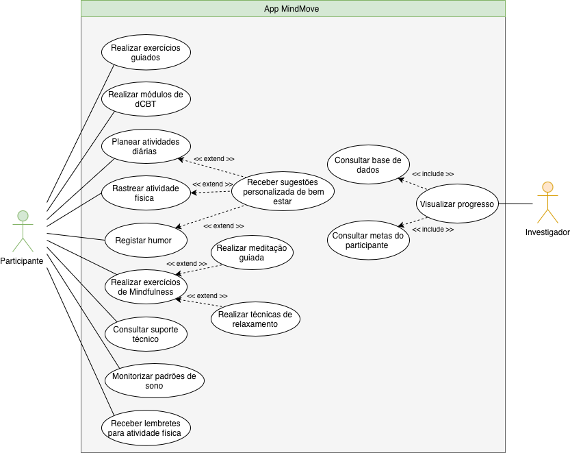
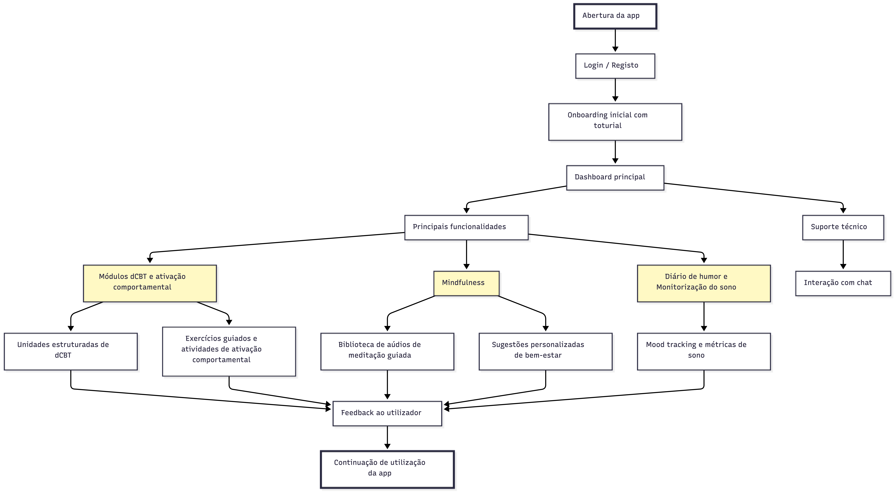
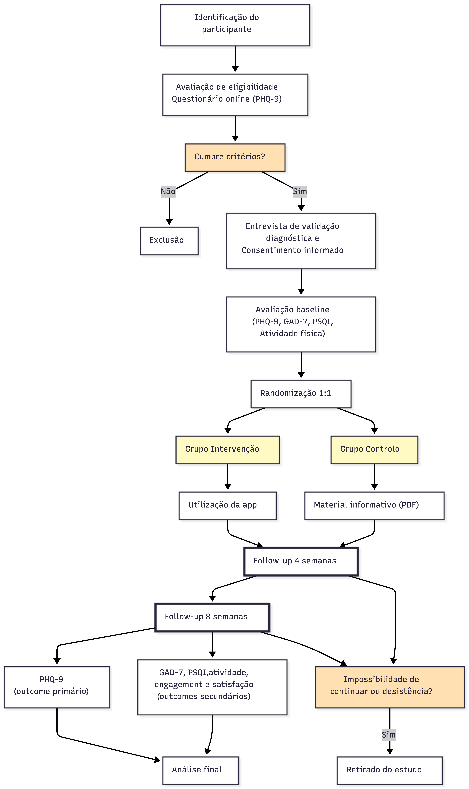

### Título do Estudo

Eficácia da Aplicação Móvel “MindMove” baseada em Terapia
Cognitivo-Comportamental Digital versus Lista de Espera com Material
Educativo na Redução de Sintomas Depressivos, Ansiedade e Melhoria da
Qualidade do Sono em Estudantes Universitários com Sintomatologia
Ligeira a Moderada: Um Ensaio Clínico Randomizado, Controlado e Paralelo

### Título Abreviado

MindMove: Eficácia dCBT em Estudantes Universitários

### Autores e Afiliações

**Investigadores Principais:**

- Maria João Marques Roso, Faculdade de Medicina da Universidade do Porto
- Inês Mota Assunção, Faculdade de Medicina da Universidade do Porto
- Maria João Lopes Roldão, Faculdade de Medicina da Universidade do Porto
- Inês Duque Formoso, Faculdade de Medicina da Universidade do Porto

**Instituição:** Faculdade de Medicina da Universidade do Porto

**Contactos:** Email(s)
- up202507727@up.pt
- up202503920@up.pt
- up202504015@up.pt
- up202004344@up.pt

### Identificação do Ensaio

**Tipo de estudo:** Ensaio clínico randomizado, controlado, paralelo

**Data de início prevista:** 02/02/26

**Data de conclusão prevista:** 28/06/26

------------------------------------------------------------------------

## 1. Introdução

### 1.1 Racional

A saúde mental dos estudantes universitários constitui um desafio de saúde pública de magnitude crescente. A transição para a vida académica, caracterizada por pressões académicas, financeiras e sociais, expõe esta população a um stress acumulado que resulta numa prevalência elevada de sintomatologia depressiva ligeira a moderada. Este período representa uma fase de vulnerabilidade crítica onde, caso não seja intervencionado precocemente, o sofrimento emocional pode comprometer o rendimento académico e progredir para quadros de depressão maior. [1]

Atualmente, o acesso aos cuidados convencionais de saúde mental enfrenta limitações estruturais severas. Nos contextos universitários, os serviços de psicologia debatem-se com listas de espera extensas e horários rígidos que dificultam a procura de ajuda. Adicionalmente, o estigma associado ao apoio presencial atua como uma barreira psicológica, levando a que muitos estudantes adiem a procura de auxílio até que os sintomas se tornem incapacitantes, perdendo-se a janela de oportunidade para uma intervenção mais eficaz. [2]

A evidência científica recente tem demonstrado que as intervenções digitais, particularmente a terapia cognitivo-comportamental digital (dCBT), são ferramentas eficazes, escaláveis e desestigmatizantes para a gestão de sintomas depressivos e ansiosos. Estas soluções permitem alcançar uma população vasta que, de outra forma, permaneceria sem suporte profissional. [3]

Este estudo pretende preencher uma lacuna na literatura ao avaliar o impacto de uma solução integrada, a aplicação “MindMove”. Ao combinar módulos de dCBT com ferramentas de ativação comportamental, diário de humor, monitorização de sono e sugestões de atividade física, o “MindMove” propõe uma abordagem holística e personalizada, desenhada especificamente para os hábitos e necessidades da população estudantil.

A escolha da lista de espera com material educativo como comparador é eticamente justificada. Este desenho assegura que o grupo controlo não é privado de suporte informativo, mantendo-se o acesso a recursos básicos de saúde mental, e garante, simultaneamente, que todos os participantes beneficiem do acesso à aplicação após a conclusão do ensaio.

A relevância clínica deste ensaio reside no seu potencial de validação como estratégia de prevenção secundária. Espera-se que a intervenção reduza a carga de sintomas depressivos, promovendo a autonomia do estudante na gestão do seu bem-estar e oferecendo às instituições de ensino superior uma ferramenta de baixo custo e alta eficácia para a promoção da saúde mental comunitária.

### 1.2 Objetivos

#### Objetivo Primário
Avaliar a eficácia da aplicação móvel MindMove na redução dos sintomas depressivos em estudantes universitários com sintomatologia ligeira a moderada, medida através da variação na pontuação da escala PHQ-9 após 8 semanas de intervenção, em comparação com um grupo de controlo em lista de espera.

#### Objetivos Secundários
1. Comparar a redução dos níveis de ansiedade entre os dois grupos, avaliada através da escala GAD-7. [6]
2. Analisar a melhoria na qualidade do sono dos participantes, utilizando o índice PSQI (Pittsburgh Sleep Quality Index). [4]
3. Avaliar o impacto da intervenção no aumento dos níveis de atividade física semanal dos estudantes.
4. Determinar o nível de engagement dos utilizadores com as funcionalidades da aplicação, incluindo o tempo de uso e a taxa de conclusão dos módulos de dCBT.
5. Monitorizar a satisfação dos participantes com a intervenção e a taxa de abandono (dropout) ao longo das 8 semanas.

------------------------------------------------------------------------

## 2. Métodos

### 2.1 Desenho do Estudo
Este é um ensaio clínico randomizado, controlado, de grupos paralelos.

**Características do desenho:**
- Randomização 1:1 (intervenção : controlo)
- Duração: 8 semanas
- Setting: 1 serviço de psicologia universitário
- Fase: Estudo piloto (pré-teste)
- Tamanho da amostra: 30 participantes (15 por braço)

**Timeline:**

Tabela 1: Cronograma do ensaio clínico MindMove

| Fase do Estudo | Duração | Descrição das Atividades |
|:---|:--:|:--:|
| **Recrutamento** | 4 semanas | Divulgação nas faculdades, triagem de elegibilidade e assinatura do consentimento informado |
| **Baseline** | 1 semana | Avaliação inicial (Questionários GAD-7, PSQI) e randomização |
| **Intervenção** | 8 semanas | Utilização da aplicação móvel MindMove (Grupo de Intervenção) vs. Lista de espera com acesso a material educativo estático (Grupo de Controlo). |
| **Follow-up** | 8 semanas | Avaliações intermédias (4ª sem) e avaliação final (8ª sem) para medir eficácia |

O diagrama CONSORT será utilizado como ferramenta de reporte deste estudo, sendo preenchido na sua totalidade após a conclusão do ensaio clínico (Figura 1).

### 2.2 População do Estudo
A população-alvo deste ensaio clínico é constituída por estudantes universitários com idades compreendidas entre os 18 e os 30 anos.

#### 2.2.1 Critérios de Inclusão
1. Estudantes universitários entre 18 e 30 anos.
2. Sintomas depressivos ligeiros a moderados.
3. PHQ-9 score entre 5 e 14.
4. Possuir e saber utilizar um smartphone com acesso à internet.
5. Capacidade de leitura e compreensão da língua portuguesa.
6. Fornecer o Consentimento Informado.
7. Disponibilidade para as 8 semanas de protocolo.

#### 2.2.2 Critérios de Exclusão
1. Diagnóstico de psicose ou intenção suicida ativa.
2. Alteração de medicação psicotrópica nas 4 semanas anteriores.
3. Condições físicas que impeçam a ativação comportamental.
4. Gestação ou lactação.
5. Sem acesso a smartphone.

### 2.3 Intervenções

#### 2.3.1 Grupo de Intervenção
Os participantes receberão a **Aplicação MindMove**.

1. **Módulos de dCBT e Ativação Comportamental:** Unidades estruturadas para reestruturação cognitiva e planeamento de atividades.
2. **Diário de Humor e Monitorização de Sono:** Registo de estado emocional e métricas de sono.

3. **Mindfulness e Sugestões Personalizadas:** Biblioteca de meditação e sugestões baseadas no humor registado.

#### 2.3.2 Grupo Controlo
Lista de espera com material educativo estático (PDF).

#### 2.3.3 Critérios de Descontinuação
Retirada voluntária, agravamento clínico severo ou violação grave do protocolo.

---

## 3. Avaliações e Outcomes

### 3.1 Outcome Primário
Pontuação total na escala PHQ-9 (*Patient Health Questionnaire-9*).

* **Instrumento:** PHQ-9, um instrumento de autorrelato validado, composto por 9 itens que avaliam a severidade dos sintomas depressivos nos últimos 14 dias, baseado nos critérios do DSM-5 (Kroenke et al., 2001).
* **Momento de avaliação:** Avaliação realizada no momento *baseline* (semana 0, pré-randomização) e no final da intervenção (semana 8).
* **Definição de sucesso:** Redução estatisticamente significativa na média da pontuação total do PHQ-9 no grupo de intervenção (MindMove) em comparação com o grupo de controlo (lista de espera) às 8 semanas, refletindo uma diminuição na severidade da sintomatologia depressiva dos participantes.

### 3.2 Outcomes Secundários

* **Redução dos níveis de ansiedade:** Avaliada através da escala *Generalized Anxiety Disorder-7* (GAD-7) nas semanas 0, 4 e 8, permitindo aferir a co-ocorrência de melhorias nos sintomas ansiosos.
* **Melhoria na qualidade do sono:** Medida através do *Pittsburgh Sleep Quality Index* (PSQI) às 8 semanas, para verificar se os módulos de higiene do sono da app resultam em benefícios clinicamente observáveis.
* **Aumento dos níveis de atividade física:** Quantificado em minutos de atividade física moderada a vigorosa por semana (através de autorrelato), para avaliar o impacto dos lembretes e incentivos da app no estilo de vida dos estudantes.
* **Nível de adesão e engagement:** Monitorizado através de métricas de utilização da app (ex: frequência de acesso semanal, tempo de uso diário e número de módulos de dCBT e técnicas de mindfulness completados) durante as 8 semanas.
* **Satisfação e aceitabilidade:** Avaliadas ao final das 8 semanas através de um questionário de satisfação (ex: *Client Satisfaction Questionnaire* - CSQ-8), para compreender a utilidade percebida e a facilidade de uso da MindMove na rotina académica.

---

## 4. Análise Estatística

A análise dos dados será realizada utilizando o software R. O nível de significância estatística será fixado em $\alpha = 0,05$ para todos os testes. Para comparar as diferenças nas médias do PHQ-9 entre o grupo de intervenção e o grupo de controlo, será utilizado o teste *t* de Student para amostras independentes, cuja estatística é calculada pela seguinte equação:

$$t = \frac{\bar{X}_1 - \bar{X}_2}{\sqrt{\frac{s_1^2}{n_1} + \frac{s_2^2}{n_2}}}$$

**Onde:**
* $\bar{X}_1$ e $\bar{X}_2$ são as médias das pontuações PHQ-9 de cada grupo;
* $s_1^2$ e $s_2^2$ são as respetivas variâncias;
* $n_1$ e $n_2$ são os tamanhos das amostras de cada braço do estudo.

A análise principal do *outcome* primário será conduzida segundo o princípio de Intenção de Tratar (*Intention-to-Treat* – ITT) (McCoy, 2017). A análise dos dados será realizada utilizando o software R. O nível de significância estatística será fixado em $\alpha = 0,05$ para todos os testes. Para minimizar o viés de exclusão, todos os 30 participantes randomizados serão incluídos na análise final, independentemente da sua adesão à aplicação MindMove. Caso haja ocorrência de desistências (*dropouts*), será utilizado o método de Imputação Múltipla para preencher os valores em falta nos questionários PHQ-9, GAD-7 e PSQI.

A análise principal do *outcome* primário (variação do *score* PHQ-9) será conduzida segundo o princípio de Intenção de Tratar (*Intention-to-Treat* – ITT). Para comparar as diferenças nas médias do PHQ-9 entre o grupo de intervenção e o grupo de controlo no final das 8 semanas, será utilizado um teste *t* de Student para amostras independentes (ou o teste não paramétrico de Mann-Whitney, caso os dados não apresentem distribuição normal). Os dados em falta (*missing data*) resultantes de abandonos serão tratados através de métodos de imputação apropriados.

### Análise dos Outcomes Secundários
Para a ansiedade (GAD-7) e qualidade do sono (PSQI), utilizaremos uma ANOVA de Medidas Repetidas para avaliar a evolução dos sintomas nos três momentos de medição (0, 4 e 8 semanas).
A adesão (*engagement*) será analisada de forma descritiva através da média e desvio-padrão do número de acessos semanais à aplicação.
A taxa de eventos adversos (ex: agravamento severo de sintomas) será comparada entre grupos através do Teste Exato de Fisher.

***
## 5. Ética e Disseminação

### 5.1 Aprovação Ética

O presente protocolo de investigação foi desenhado em estrita
conformidade com a Declaração de Helsínquia e com as diretrizes de Boas
Práticas Clínicas (GCP). \[7\] O estudo será submetido para apreciação e
aprovação pela Comissão de Ética da Faculdade de Medicina da
Universidade do Porto (CEFMUP) antes do início de qualquer procedimento
de recrutamento. Quaisquer alterações substanciais ao protocolo serão
formalmente comunicadas e submetidas a nova aprovação ética.

### 5.2 Consentimento Informado

A obtenção do Consentimento Informado, Livre e Esclarecido (CILE) será
realizada de forma digital durante a fase de *screening*. Os potenciais
participantes receberão um documento detalhado contendo os objetivos do
estudo, os procedimentos envolvidos, os potenciais riscos e benefícios,
e a garantia de que a participação é totalmente voluntária. Sendo a
população composta por estudantes universitários, será explicitamente
clarificado que a recusa em participar ou a desistência do estudo em
qualquer fase não acarretará qualquer penalização académica ou perda de
acesso a cuidados de saúde habituais. O consentimento formal será
registado através de uma assinatura digital segura antes da
randomização.

### 5.3 Confidencialidade e Proteção de Dados

O tratamento de dados pessoais e clínicos cumprirá rigorosamente o
Regulamento Geral sobre a Proteção de Dados (RGPD). Todos os dados
recolhidos através da aplicação móvel *MindMove* ou de questionários
online serão pseudonimizados, sendo atribuído um código alfanumérico
único a cada participante. A chave de identificação que liga os códigos
aos dados pessoais será guardada de forma encriptada num servidor seguro
da instituição, com acesso restrito aos investigadores principais. Os
dados gerados pela interação com a aplicação serão armazenados em
servidores *cloud* com certificação de segurança na área da saúde e não
serão partilhados com terceiros para fins comerciais.

### 5.4 Política de Disseminação

Os resultados deste ensaio clínico, quer sejam positivos, negativos ou
inconclusivos, serão submetidos para publicação em revistas científicas
com revisão por pares na área da saúde mental digital e psiquiatria. Os
dados serão apresentados de forma agregada, garantindo o total anonimato
dos participantes. Adicionalmente, os resultados serão partilhados em
conferências científicas da especialidade. Após a conclusão e análise
dos dados, será enviado um resumo em linguagem acessível a todos os
participantes do estudo, e a intervenção *MindMove* será disponibilizada
gratuitamente aos estudantes que integraram o grupo de controlo.

## 6. Referências Bibliográficas

### 6.1 Referências
1. Ibrahim, A.K., et al., A systematic review of studies of depression prevalence in university students. *J Psychiatr Res*, 2013. **47**(3): p. 391–400.
2. Gulliver, A., K.M. Griffiths, and H. Christensen, Perceived barriers and facilitators to mental health help-seeking in young people: a systematic review. *BMC Psychiatry*, 2010. **10**: p. 113.
3. Karyotaki, E., et al., Internet-Based Cognitive Behavioral Therapy for Depression: A Systematic Review and Individual Patient Data Network Meta-analysis. *JAMA Psychiatry*, 2021. **78**(4): p. 361–371.
4. Spitzer, R.L., et al., A brief measure for assessing generalized anxiety disorder: the GAD-7. *Arch Intern Med*, 2006. **166**(10): p. 1092–7.
5. Kroenke, K., R.L. Spitzer, and J.B. Williams, The PHQ-9: validity of a brief depression severity measure. *J Gen Intern Med*, 2001. **16**(9): p. 606–13.
6. World Medical, A., World Medical Association Declaration of Helsinki: ethical principles for medical research involving human subjects. *JAMA*, 2013. **310**(20): p. 2191–4.

---

**Versão:** 1.1  
**Data desta versão:** 26/03/26  
**Autores desta versão:** Maria João Marques Roso, Inês Mota Assunção, Maria João Lopes Roldão, Inês Duque Formoso

